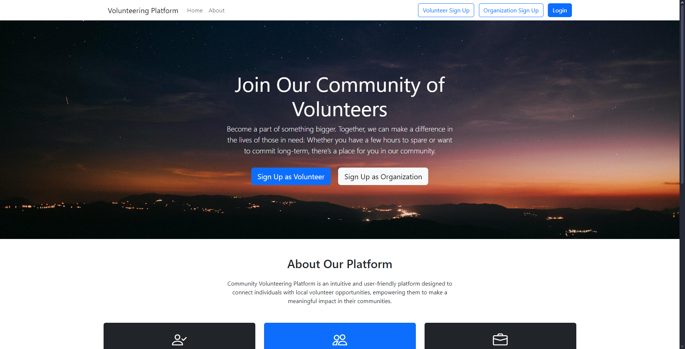
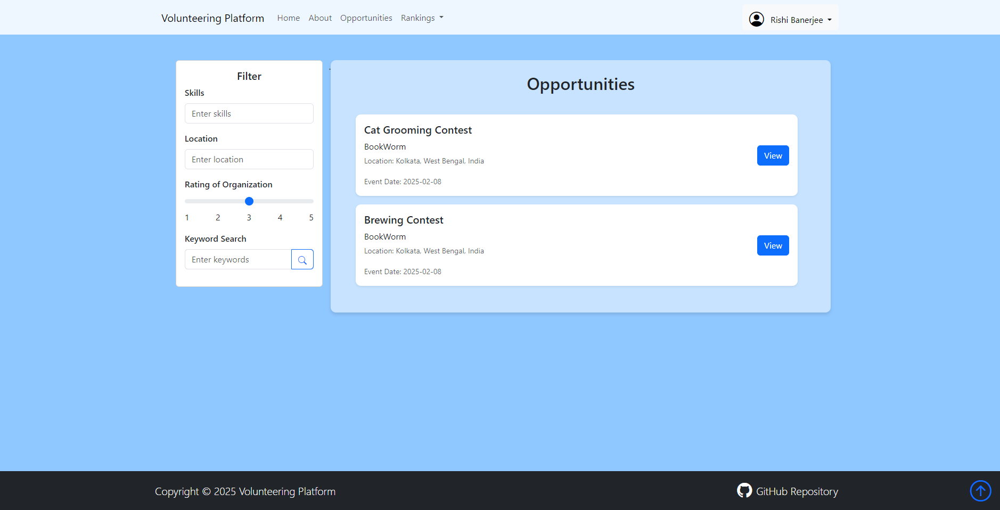
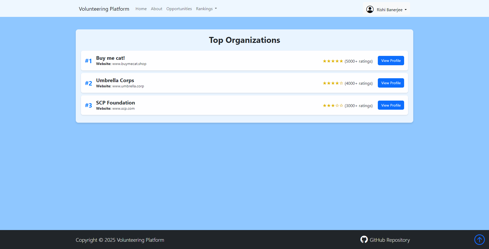
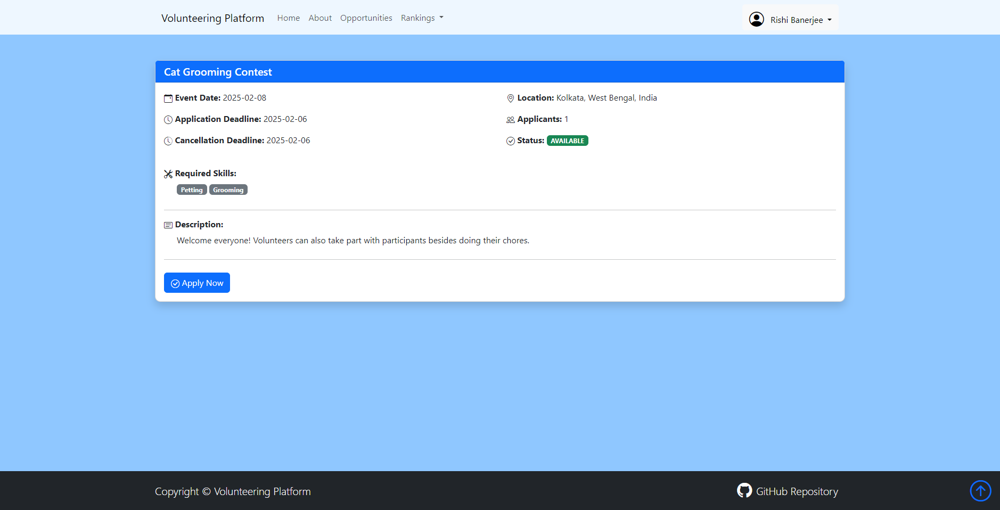
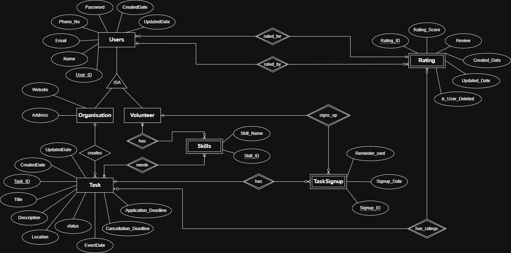
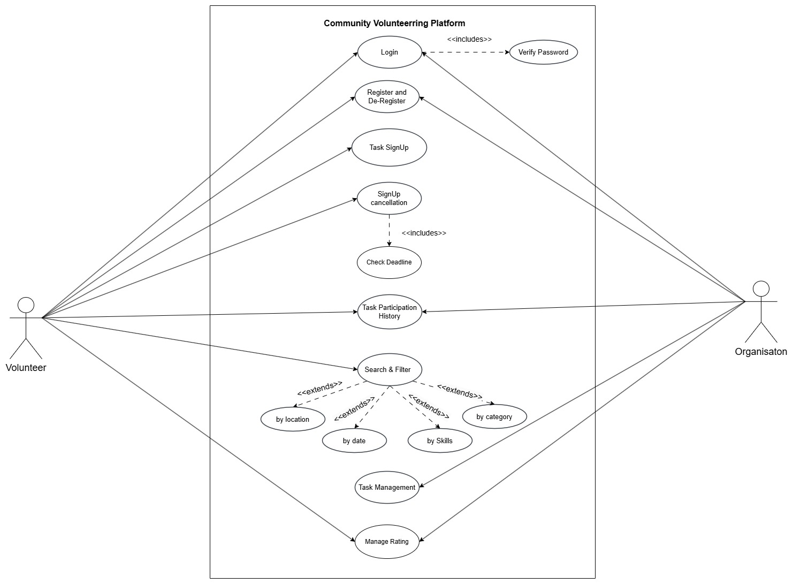
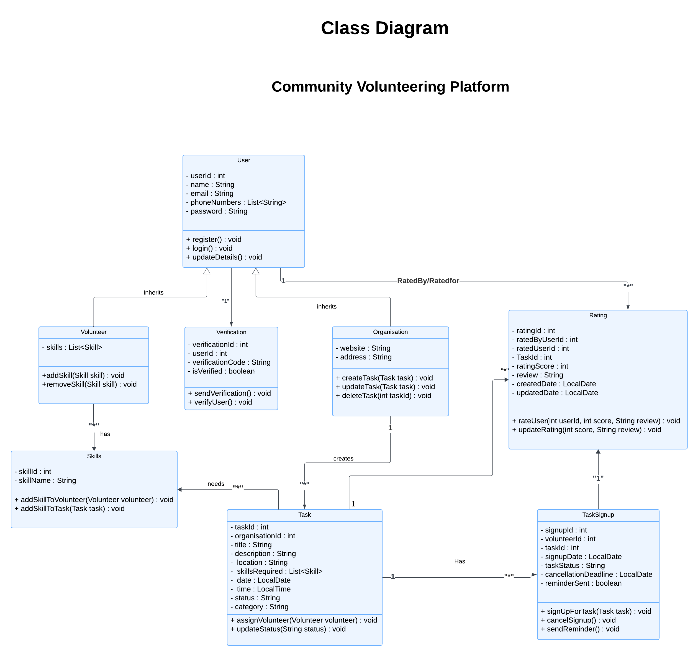
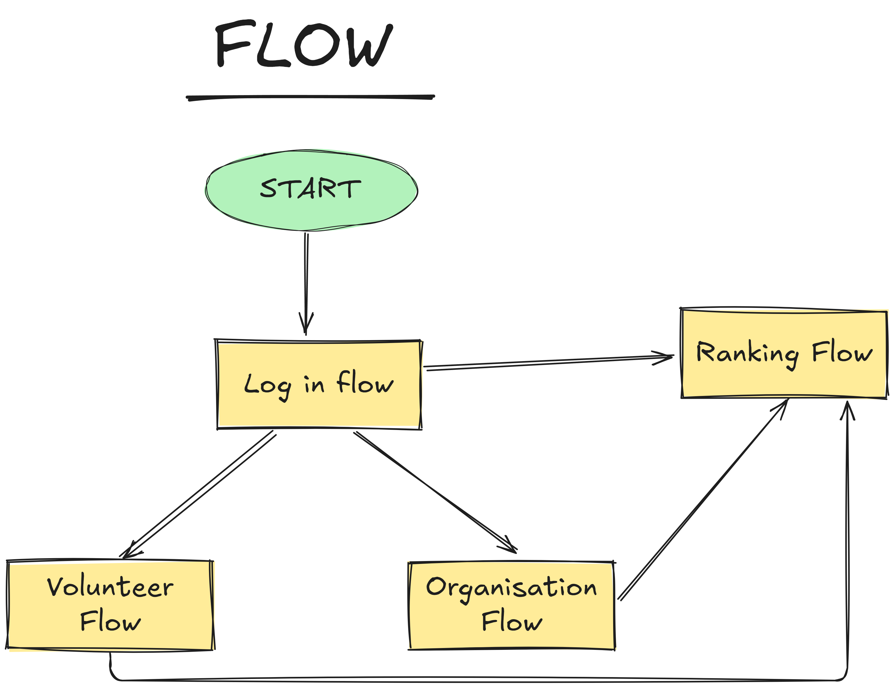

# 🌍 Community Volunteering Platform

**Community Volunteering Platform** is an intuitive and user-friendly web application designed to connect individuals with local volunteer opportunities. This platform enables volunteers and organizations to collaborate, making it easier to discover causes, match skills, and contribute to social impact projects.

---

## 📚 Table of Contents

- [🌍 Community Volunteering Platform](#-community-volunteering-platform)
- [📸 Screenshots](#-screenshots)
- [🚀 Features](#-features)
- [📅 Milestones & Tasks](#-milestones--tasks)
- [📜 License](#-license)
- [🛠️ Tools & Technology Stack](#%EF%B8%8F-tools--technology-stack)
- [👩‍💻 Developers](#-developers)
- [📜 Project Artifacts](#-project-artifacts)

---

## 📸 Screenshots

Here are some screenshots of the platform:

  
  

  
  

---

## 🚀 Features

- **User Registration**: Sign up as a volunteer or organization with secure authentication.
- **Volunteer Opportunities**: Organizations can create, update, and delete volunteering tasks.
- **Search & Filter**: Advanced search by keywords, location, skills, and date.
- **Task Signup & Reminders**: Volunteers can sign up, receive notifications, and track their participation history.
- **Ratings & Reviews**: Volunteers and organizations can rate and review each other.
- **Profile Management**: Users can update their profiles and manage their activities.
- **Secure Access**: Password-protected login with email verification and recovery options.

---

## 📅 Milestones & Tasks

| Milestone  | Weeks       | Task Completion                  |
|------------|------------|----------------------------------|
| 1          | Week 1 & 2  | Artifacts (Wireframes, Diagrams) |
| 2          | Week 3 & 4  | Backend module implementation   |
| 3          | Week 5 & 6  | Frontend module implementation  |
| 4          | Week 7 & 8  | Project Integration             |

---

## 📜 License
PaperTrail is released under the MIT License. See the [LICENSE](./LICENSE) file for more information.

---

## 🛠️ Tools & Technology Stack  

### Tools Used  
  <ol>
    <li>Java</li>
    <li>MySQL</li>
    <li>MySQL Workbench</li>
    <li>Aiven</li>
    <li>Spring Boot</li>
    <li>Thymeleaf</li>
    <li>IntelliJ IDEA / Eclipse / VSCode</li>
    <li>Postman</li>
    <li>Excalidraw</li>
    <li>Draw.io</li>
  </ol>

### 🔗 Link to Tools  

&emsp;
&emsp;
&emsp;
&emsp;
&emsp;
&emsp;
&emsp;
&emsp;
&emsp;
&emsp;
&emsp;
&emsp;

---

## 👩‍💻 Developers
<ul>
  <li><a href="https://github.com/QwertyFusion">[@QwertyFusion]</a></li>
  <li><a href="https://github.com/Umensalma">[@Umensalma]</a></li>
  <li><a href="https://github.com/Gladys-12">[@Gladys-12]</a></li>
  <li><a href="https://github.com/vkupadhyay2609">[@vkupadhyay2609]</a></li>
</ul>

---

## 📜 Project Artifacts

This section outlines the important artifacts created during the project phase, categorized by their types.

### 1. Diagrams
Diagrams illustrate the system's architecture and relationships between different components.

#### ER Diagram

  

#### Use Case Diagram

  

#### Class Diagram

  

### 2. Wireframes
Wireframes provide a visual representation of the user interface and user experience flows.

  

  
  

  
  

